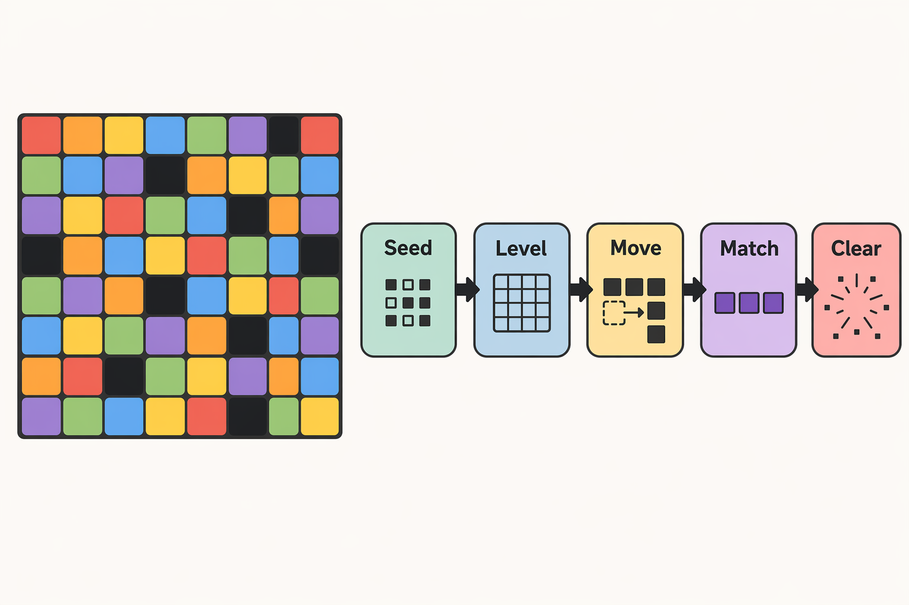
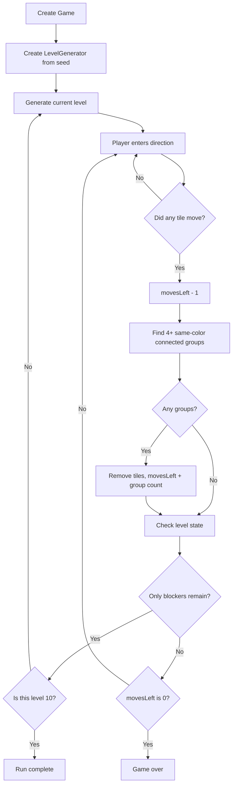
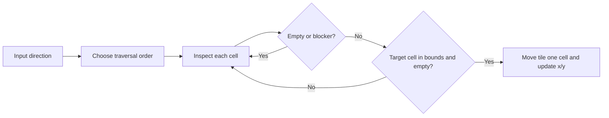
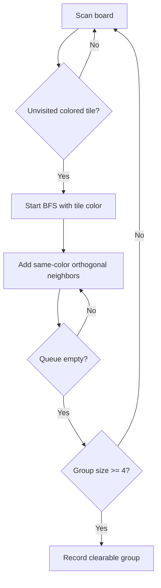
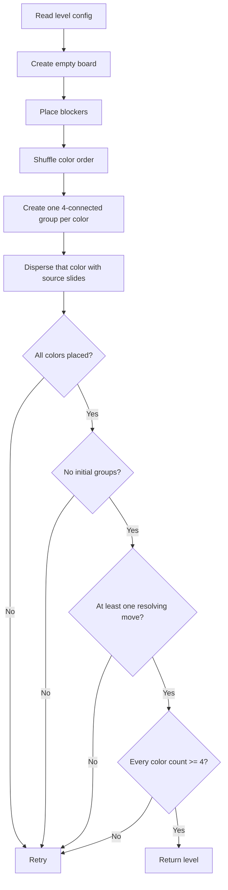
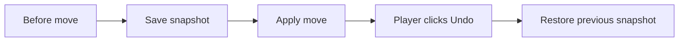
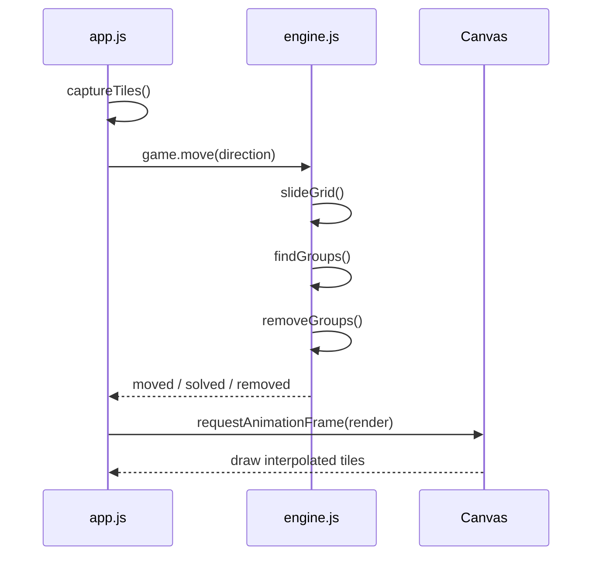

# Minimal Color Tiles

Minimal Color Tiles is a small browser puzzle game inspired by Google Color Tiles. The player moves colored tiles on a square board, clears connected groups of matching colors, manages a limited move count, and progresses through 10 levels.



The game itself uses no image assets. The board and pieces are drawn with Canvas color blocks.

## Quick Start

```bash
npm start
```

Open:

```text
http://127.0.0.1:4173
```

Run tests:

```bash
npm test
```

## Project Layout

```text
github/
├── index.html          # Static page
├── server.js           # Local static server
├── docs/
│   └── algorithm-overview.png
├── src/
│   ├── engine.js       # Game rules, RNG, level generation, matching, undo
│   ├── app.js          # Canvas rendering, input, movement animation
│   └── styles.css      # Minimal responsive styling
└── tests/
    └── engine.test.js  # Core algorithm tests
```

## Game Rules

The board is an `N x N` square grid. The player can use arrow keys, WASD, swipe gestures, or direction buttons.

| Element | Meaning |
| --- | --- |
| Colored tile | Movable tile that can be matched and cleared |
| Black tile | Blocker; it never moves and never clears |
| Empty cell | A space that a tile can move into |
| Moves | A valid move costs 1 move |

Win condition:

```text
Only blockers remain, or the board is completely empty.
```

Loss condition:

```text
Colored tiles remain, but moves left is 0.
```

Clear rule:

```text
Four or more same-color tiles connected orthogonally are removed.
Each removed group gives 1 move back.
```

Example:

```text
Before clear:

R R . .
R R B .
. G . .
. . . .

R forms a connected group of 4. B is a blocker.

After clear:

. . . .
. . B .
. G . .
. . . .

The player receives +1 move.
```

## The 10 Levels

This version has exactly 10 configured levels. The configuration lives in `src/engine.js` as `LEVEL_CONFIGS`.

| Level | Board | Colors | Blockers |
| --- | --- | --- | --- |
| 1 | 3x3 | 2 | 0 |
| 2 | 4x4 | 3 | 0 |
| 3 | 4x4 | 3 | 0 |
| 4 | 5x5 | 4 | 1 |
| 5 | 5x5 | 4 | 1 |
| 6 | 5x5 | 4 | 2 |
| 7 | 6x6 | 5 | 2 |
| 8 | 6x6 | 5 | 3 |
| 9 | 6x6 | 5 | 3 |
| 10 | 7x7 | 6 | 4 |

After level 10, the generator stops. It does not reuse the final configuration forever.

## Runtime Flow



## Seed and Randomness

The game uses deterministic randomness instead of `Math.random()`. The same seed always produces the same 10-level run.

### Daily Seed

```js
export function dailySeed(date = new Date()) {
  const utcMinusFive = new Date(date.getTime() - 5 * 60 * 60 * 1000);
  return Date.parse(utcMinusFive.toISOString().slice(0, 10)) >>> 0;
}
```

This function:

1. Converts the current time to UTC-5.
2. Extracts the date string, such as `2026-07-15`.
3. Converts that date to a number with `Date.parse()`.
4. Converts the number to an unsigned 32-bit integer with `>>> 0`.

The fixed UTC-5 date boundary makes the daily puzzle change at a predictable time instead of depending on each player's local timezone.

### LCG Pseudo-Random Number Generator

```js
this.seed = (this.seed * 1664525 + 1013904223) >>> 0;
return this.seed / 4294967296;
```

This is a linear congruential generator:

```text
next = (seed * A + C) mod M
```

| Constant | Value | Purpose |
| --- | --- | --- |
| `A` | `1664525` | Multiplier |
| `C` | `1013904223` | Increment |
| `M` | `4294967296` | `2^32`, the 32-bit integer space |

In JavaScript, `>>> 0` coerces the result to an unsigned 32-bit integer, which effectively applies modulo `2^32`. Dividing by `4294967296` maps the integer to a floating-point number in `[0, 1)`.

This generator is not meant to be cryptographically secure. It is small, deterministic, easy to inspect, and good enough for reproducible puzzle generation.

## Board Data Model

The board is a column-major two-dimensional array:

```js
grid[x][y]
```

A tile is represented as:

```js
{
  x: 2,
  y: 3,
  color: 1,
  blocker: false
}
```

Empty cells are stored as `null`.

Coordinate example:

```text
(0,0) (1,0) (2,0)
(0,1) (1,1) (2,1)
(0,2) (1,2) (2,2)

grid[1][2] means x=1, y=2.
```

## Movement Algorithm

A move does not slide tiles all the way to the edge. Every movable tile can move at most one cell.

Example: moving right.

```text
Before:

R . . .
G B . .
. Y . .
. . . .

After:

. R . .
G B . .
. . Y .
. . . .
```

Rules:

- `R` moves right because the next cell is empty.
- `G` cannot move because a blocker is directly to the right.
- `Y` moves right because the next cell is empty.

Traversal order matters:

- Moving right scans from right to left.
- Moving left scans from left to right.
- Moving down scans from bottom to top.
- Moving up scans from top to bottom.



Core function:

```js
slideGrid(grid, dir)
```

Return value:

```text
true  = at least one tile moved
false = no tile could move
```

Only a `true` move costs 1 move.

## Connected Group Search

Clearing uses breadth-first search. Only orthogonal neighbors count; diagonal adjacency does not.

```text
Valid connection:

R R
R R

Invalid diagonal-only connection:

R .
. R
```



Core function:

```js
findGroups(grid)
```

It returns an array of groups:

```js
[
  [tile, tile, tile, tile],
  [tile, tile, tile, tile, tile]
]
```

Each inner array is one clearable connected group.

## Clearing and Move Economy

Clearing is split into two operations:

```js
const groups = findGroups(grid);
const clear = removeGroups(grid, groups);
```

Return value:

```js
{
  groupsRemoved: 1,
  tilesRemoved: 4
}
```

Move economy:

```text
Valid move: -1
Each cleared group: +1
```

If one move clears two groups:

```text
net move change = -1 + 2 = +1
```

## Level Generation

The generator tries to produce levels with these properties:

1. The initial board has no already-clearable group.
2. At least one next move can create a clear.
3. Every color appears at least 4 times.
4. The result is deterministic for the same seed.

The generator does not fill the board randomly. It builds levels backwards.

### Intuition

First, create a solved 4-connected group:

```text
R R
R R
```

Then disperse that group with seeded source slides:

```text
Before dispersal:

R R . .
R R . .
. . . .
. . . .

After dispersal:

R . R .
. R . .
R . . .
. . . .
```

During play, moving in the opposite direction can bring tiles back together and create a clear.

### Generation Flow



### Why Backward Generation Works

Pure random boards often fail in two ways:

- They already contain a clearable group before the player moves.
- They contain no useful move and feel unsolvable.

Backward generation starts with a known clearable structure and then disperses it. That makes it much easier to generate boards that demonstrate the intended mechanic.

## Source Slide

`sourceRandomSlide()` is used only during level generation. It is similar to player movement because tiles still move at most one cell, but not every tile is forced to move.

```js
this.slideOnce(grid, dir, (x, y) => {
  const distance = this.sourceDistance(grid, x, y, this.oppositeDir(dir));
  return rng.next() * (distance + 1) < distance || !Number.isFinite(distance);
});
```

The farther a tile can see in the opposite direction, the more likely it is to participate in the dispersal. This keeps generated boards from looking too uniform.

## Undo

Undo uses snapshots:

```js
snapshot() {
  return {
    movesLeft: this.movesLeft,
    grid: cloneGrid(this.grid),
  };
}
```

Before every valid move, the current state is pushed into `history`. Undo pops the latest snapshot and restores it.



## Rendering and Animation

`engine.js` does not know about the UI. It only owns rules and state transitions. The browser layer in `src/app.js` draws the game with Canvas.

Movement animation is visual only:

1. Record each tile's coordinates before the move.
2. Run the engine move and clear logic.
3. Interpolate Canvas drawing from old coordinates to new coordinates over 180ms.
4. If a tile was cleared, move it to the target position and fade it out.



## Tests

`tests/engine.test.js` covers:

- The same seed generates the same level.
- Generated boards do not start with a clearable group.
- At least one next move can create a clear.
- Blockers do not move.
- Four connected same-color tiles can be found and removed.
- A move can be undone.

## Useful Modifications

Common changes:

- Edit `LEVEL_CONFIGS` to tune difficulty.
- Replace `dailySeed()` with fixed seeds, share codes, or daily challenge ids.
- Change `findGroups()` to clear 3-connected or 5-connected groups.
- Change `slideGrid()` from one-cell movement to slide-to-edge movement.
- Change `removeGroups()` rewards from "one move per group" to "one move per four tiles".

## Related

- [Play Color Tiles online](https://colortilesgame.com)
- [From the 40s to 97: How We Cut the Initial Load of a Next.js WebGL Game by Nearly 80%](https://medium.com/@winterscott999/from-the-40s-to-97-how-we-cut-the-initial-load-of-a-next-js-webgl-game-by-nearly-80-d04e803a27ac)

## License

MIT License
